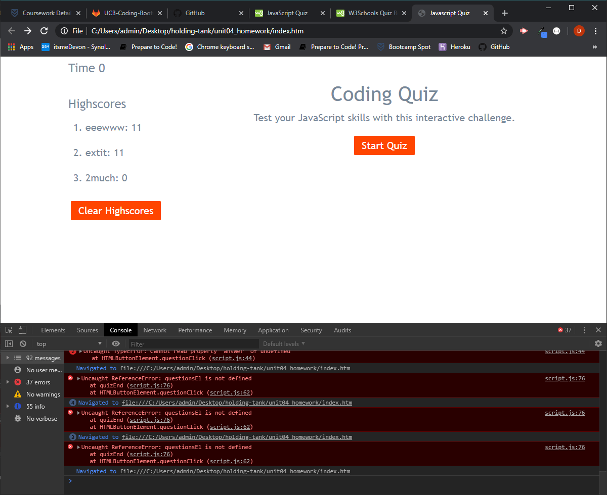

# JavaScript Quiz

In this assignment, here is a code quiz with multiple-choice questions built in Javascript, HTML, CSS. 

## Little refresher

Whats strange, I saw some of the old code in this file. I wonder why I didn't finish it before? It was all there, I just had to clean it up and make sure the HTML classes were changed for the Javascript.

## Getting Started

To get started with the Code Quiz, use any web browser to view live link, (https://itsmedexter.github.io/unit04_homework/). Repository link, (https://github.com/itsmedexter/unit04_homework).

## Technolgies Used

* [HTML](https://developer.mozilla.org/en-US/docs/Web/HTML)
* [CSS](https://developer.mozilla.org/en-US/docs/Web/CSS)
* [Bootstrap](https://stackpath.bootstrapcdn.com/bootstrap/4.3.1/css/bootstrap.min.css)
* [Javascript](https://developer.mozilla.org/en-US/docs/Web/JavaScript)

## Deployed Link

* [See Live Site](https://itsmedexter.github.io/unit04_homework/)

## Authors

Dexter Valencia 

- [Link to Portfolio Site](https://github.com/itsmedexter/unit04_homework)
- [Link to Github](https://github.com/itsmedexter)
- [Link to LinkedIn](https://www.linkedin.com/in/dextervalencia/)

## License

This project is licensed under the MIT License 

## Acknowledgments

* Thanks to Mahisha and Kerwin for helping me get through this.  
